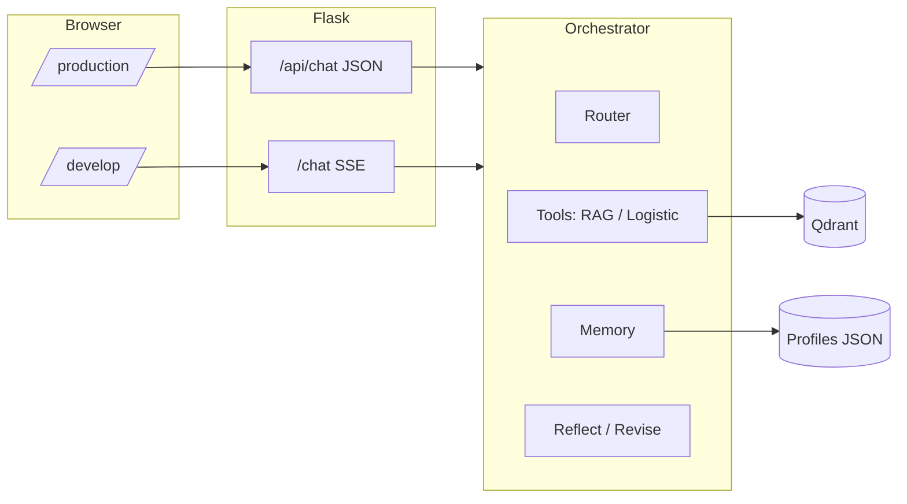

# Kapruka Gift Concierge Agent

An AI-powered **gift and delivery assistant** for Kapruka-style use cases: product and FAQ answers over **RAG (Qdrant)**, **delivery / logistics intents**, **long-term recipient profiles**, and a **reflection step** so replies stay safer against known constraints (e.g. allergies). The app is a **Flask** service with a **mobile-friendly production chat UI** and a **developer view** with live pipeline updates over **Server-Sent Events (SSE)**.

---

## Features

| Area | What it does |
|------|----------------|
| **Routing** | LLM classifies the user message into `direct`, `rag`, or `logistic` paths. |
| **RAG** | Retrieves grounded context from **Qdrant** (product / knowledge chunks) before answering. |
| **Logistics** | Tool path for delivery-area style questions when routed. |
| **Memory** | Long-term **recipient profiles** (JSON-backed locally; designed to extend to hosted DB). |
| **Reflection** | Checks drafted answers against profiles; can **revise** if something looks inconsistent or unsafe. |
| **UIs** | **`/production`** — simple JSON chat for end users. **`/develop`** — SSE stream of pipeline steps. |
| **Deploy** | **`vercel.json`** targets `app.py` with the Vercel Python runtime (profiles copied to `/tmp` on cold start). |

---

## Tech stack

- **Python 3.12+** (Vercel default); **Flask**, **Gunicorn** for production-style serving  
- **LangChain** (community, OpenAI integration, Qdrant helpers), **OpenAI**-compatible chat APIs  
- **Qdrant** (vectors + optional semantic cache per `config/param.yaml`)  
- **Pydantic**, **Loguru**, **PyYAML** for config and logging  
- **Playwright / BeautifulSoup** (ingestion / crawling toolchain)  
- Front end: **Jinja templates** (`templates/production.html`, `templates/develop.html`) — responsive layout, safe areas, 16px inputs to avoid iOS focus zoom  

---

## How requests flow (high level)



---

## Prerequisites

- Python **3.12** (recommended; match Vercel unless you pin `.python-version`)  
- API keys for your chosen **chat provider** (see `config/param.yaml` — e.g. OpenAI, Groq for router, OpenRouter, etc.)  
- **Qdrant Cloud** URL + API key if you use RAG ingestion (see Environment variables)  

---

## Quick start (local)

```bash
# Clone and enter the repo
git clone https://github.com/dinod001/kapruka-gift-concierge-agent.git
cd kapruka-gift-concierge-agent

# Virtual environment (example)
python -m venv .venv
.\.venv\Scripts\activate          # Windows
# source .venv/bin/activate       # macOS / Linux

pip install -r requirements.txt
```

Create a **`.env`** in the project root (secrets only; never commit it). At minimum you typically need:

```env
# Active provider is driven by config/param.yaml — set the matching key(s):
OPENAI_API_KEY=sk-...
GROQ_API_KEY=gsk_...            # used for router / extractor in default config

# Qdrant (RAG + cache collections)
QDRANT_URL=https://xxxx.cloud.qdrant.io
QDRANT_API_KEY=...
QDRANT_COLLECTION_NAME=kapruka-gift-concierge-agent
```

Run the app:

```bash
python app.py
```

Then open:

- **http://127.0.0.1:5000/production** — end-user chat  
- **http://127.0.0.1:5000/develop** — agent pipeline with SSE  

---

## API

| Method & path | Purpose |
|---------------|---------|
| `GET /` | Redirects to `/production` |
| `GET /production` | Production HTML UI |
| `GET /develop` | Developer HTML UI (SSE client) |
| `POST /api/chat` | JSON body: `{"message": "..."}` → `answer`, `route`, `violated`, `latency` |
| `POST /chat` | Same input; **SSE** stream with `step` events until `done` or `error` |
| `GET /profiles` | List long-term recipient profiles |
| `DELETE /profiles` | Clear profiles (dev / reset) |

---

## Configuration (non-secrets)

- **`config/param.yaml`** — provider, tiers, retrieval, CAG/CRAG, paths  
- **`config/models.yaml`** — model IDs per provider  
- **`config/faqs.yaml`** — optional FAQ list for routing/helpers  

Secrets stay in **`.env`** only.

---

## Knowledge base ingestion (Qdrant)

Populate or refresh vectors from your ingestion pipeline:

```bash
# Windows PowerShell (example)
$env:PYTHONPATH = "src"
python scripts/ingest_to_qdrant.py

# Recreate collection from scratch
python scripts/ingest_to_qdrant.py --recreate
```

Ensure `QDRANT_*` and embedding-related keys match `config/param.yaml`.

---

## Deploy on Vercel

- This repo includes **`vercel.json`** routing all requests to **`app.py`** (`@vercel/python`).  
- Set the same environment variables in the Vercel project settings.  
- Long-term profile file: on Vercel, **`data/recipient_profiles.json`** is copied into **`/tmp`** when possible (read-only filesystem elsewhere).  

---

## Tests

```bash
pytest tests -q
```

If imports fail, run from the repo root with `PYTHONPATH=src` (or `src` on `sys.path` as in `app.py`).

---

## Project layout (abbreviated)

```
.
├── app.py                 # Flask app, routes, SSE + JSON chat
├── vercel.json            # Vercel build / routes
├── requirements.txt
├── config/                # YAML params & models (no secrets)
├── data/                  # KB inputs, optional profiles template
├── scripts/
│   └── ingest_to_qdrant.py
├── src/
│   ├── agents/            # Orchestrator, router, tools, prompts
│   ├── memory/            # ST/LT memory helpers
│   ├── services/          # RAG/CRAG/CAG, ingest, chat
│   └── infrastructure/  # Config, LLM, Qdrant client
├── templates/             # production.html, develop.html
└── tests/
```

---

## License & attribution

Add a license file if you open-source this repository publicly. Until then, treat usage as under your team’s policy.

---

## Troubleshooting

| Symptom | Idea |
|---------|------|
| **“Missing API key”** | Match `config/param.yaml` `provider` to the right `*_API_KEY` in `.env`. |
| **RAG empty / errors** | Confirm `QDRANT_URL`, `QDRANT_API_KEY`, collection name, and run ingestion. |
| **Mobile UI tiny / zoom on input** | Use **Deploy** with latest `production.html`; ensure **no “Desktop site”** in mobile Chrome; viewport meta must be served (already in template). |
| **SSE hangs on serverless** | Long cold starts or timeouts can affect streaming; **`/api/chat`** is the robust path for production UIs. |

---

Built as a **gift-concierge + RAG agent** demo: configurable models, Qdrant-backed retrieval, and guardrailed answers suitable for customer-facing chat.
